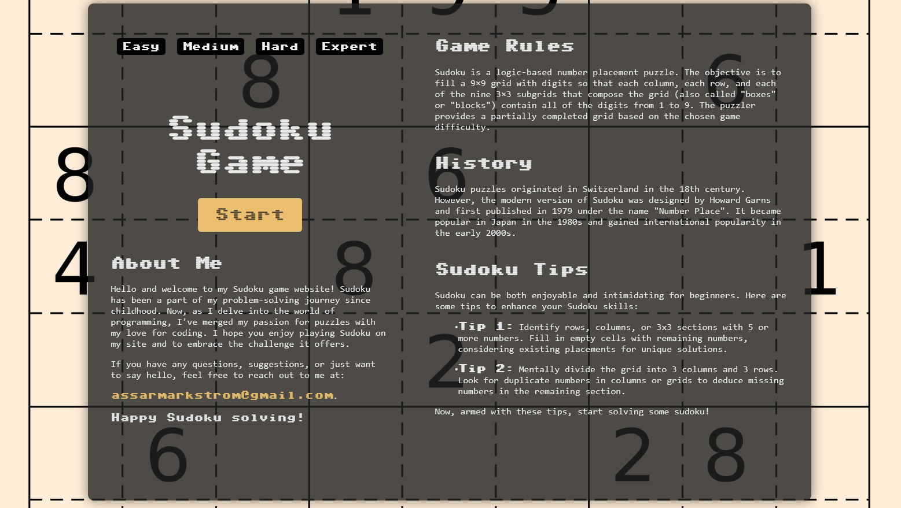
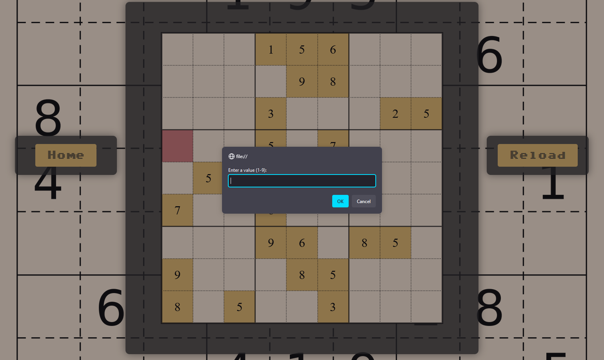

# sudoku-gamepage

This is a simple web-based Sudoku game created as a final project for an introductory web development course.

## Summary

The Sudoku Game project aims to create an interactive and user-friendly web application for playing Sudoku. This project demonstrates the use of HTML, CSS, and JavaScript to build a complete and functional game, showcasing web development skills acquired during the course.

The program allows the user to solve Sudoku of the desired difficulty level. On the “home page” the user can select the difficulty level of the Sudoku. In addition to this the user can read a little briefly about the rules of the game, the history of the game, game tips or some trivia about the creator of the page. Once the user has selected the difficulty level and pressed the start button, the user is redirected to a new web page where a sudoku board is presented. The generation of the sudoku board is directly linked to the chosen difficulty level. On the the “game page” itself, there are two additional buttons. One takes the user directly back to the “home” page and the other button, “reload”, generates a new sudoku board of the same difficulty level. The user solves the sudoku by pressing on an empty box and typing a correct digit. If the wrong number is entered, the user is warned and the box remains empty.

### Basic Representation

Below is a basic representation of how the Sudoku game works:

<div style="display: flex;">
    
    
</div>

## Table of Contents

- [Summary](#summary)
- [Installation](#installation)
- [Usage](#usage)
- [File Overview](#file-overview)
- [License](#license)

## Installation

To run the Sudoku game locally:

1. Clone the repository:
   ```sh
   git clone https://github.com/yourusername/sudoku-game.git
   ```
2. Navigate to the project directory:
   ```sh
   cd sudoku-game
   ```
3. Open `index.html` in your web browser.

## Usage

Open `index.html` in a web browser to start playing the game. Ensure that all associated files (CSS, JavaScript, fonts, and images) are in the correct directories.

## File Overview

- **index.html**: The homepage HTML file.
- **solveSudoku.html**: The gamepage HTML file.
- **css/**: Contains all CSS files.
  - `mainStyle.css`: Main stylesheet for general styling.
  - `sudokuStyle.css`: Styles specific to the Sudoku board.
- **js/**: Contains all JavaScript files.
  - `index.js`: Main JavaScript file to handle the game logic.
  - `sudoku.js`: Additional JavaScript functions specific to the Sudoku game.
- **assets/**: Contains non-code assets like fonts and images.
  - **fonts/**: Contains custom fonts.
    - `Sixtyfour-Regular-VariableFont_BLED,SCAN.ttf`: Custom font used in the project.
  - **images/**: Contains images used in the project.
    - `Sudoku_trans.png`: Image asset used in the project.
- **tests/**: Contains test files.
  - `tests.txt`: Basic tests for game functionality.

## License

This project is open-source and available under the MIT License.

## Detailed Report

For a comprehensive project report, including detailed descriptions of each phase and design decisions, please refer to [Extended Project Report](./assets/project_report.pdf).
